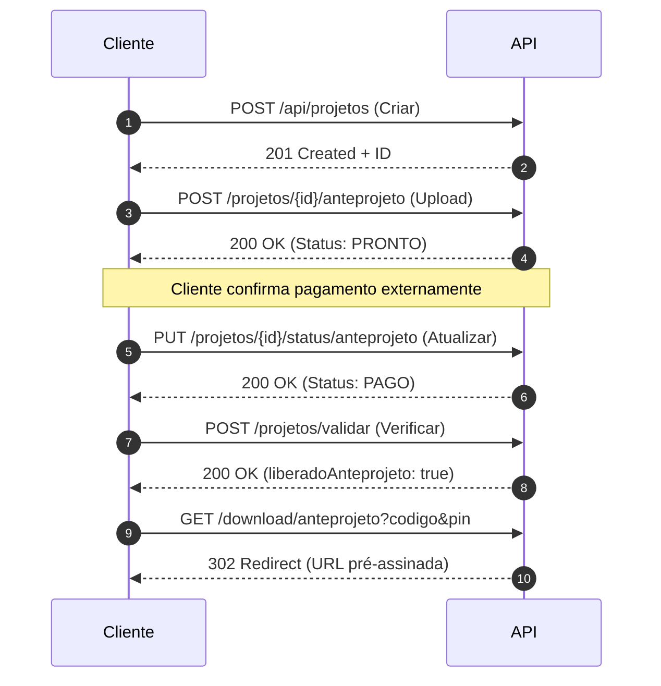

# 📚 Documentação da API - Sistema de Liberação de Projetos

## Base URL

```
Desenvolvimento: http://localhost:8080
Produção: https://seu-app.onrender.com
```

---

## 📑 Índice

1. [Autenticação](#autenticação)
2. [Gestão de Projetos](#gestão-de-projetos)
3. [Upload de Documentos](#upload-de-documentos)
4. [Download de Documentos](#download-de-documentos)
5. [Atualização de Status](#atualização-de-status)
6. [Códigos de Status HTTP](#códigos-de-status-http)
7. [Tratamento de Erros](#tratamento-de-erros)

---

## 🔐 Autenticação

O sistema utiliza autenticação baseada em **Código de Acesso** + **PIN** para todas as operações sensíveis.

### Estrutura de Autenticação

```json
{
  "codigoAcesso": "string (único)",
  "pinAcesso": "string (4 dígitos recomendado)"
}
```

---

## 📋 Gestão de Projetos

### 1. Criar Novo Projeto

Cria um novo projeto no sistema com código de acesso e PIN únicos.

**Endpoint:** `POST /api/projetos`

**Headers:**
```
Content-Type: application/json
```

**Request Body:**
```json
{
  "codigoAcesso": "PROJ001",
  "pinAcesso": "1234",
  "nomeCliente": "Construtora ABC Ltda",
  "precoAnteprojeto": 1000.00,
  "precoExecutivo": 5000.00
}
```

**Response:** `201 Created`
```json
{
  "id": 1,
  "codigoAcesso": "PROJ001",
  "nomeCliente": "Construtora ABC Ltda",
  "precoAnteprojeto": 1000.00,
  "precoExecutivo": 5000.00,
  "statusAnteprojeto": "AGUARDANDO_PAGAMENTO",
  "statusExecutivo": "AGUARDANDO_PAGAMENTO",
  "urlAnteprojeto": null,
  "urlExecutivo": null,
  "dataCriacao": "2025-02-04T10:30:00Z"
}
```

**Validações:**
- `codigoAcesso`: Único, não pode existir outro projeto com o mesmo código
- `pinAcesso`: Obrigatório
- `nomeCliente`: Obrigatório, mínimo 3 caracteres
- `precoAnteprojeto`: Positivo
- `precoExecutivo`: Positivo

**Possíveis Erros:**
- `400 Bad Request`: Dados inválidos
- `409 Conflict`: Código de acesso já existe

---

### 2. Validar Acesso ao Projeto

Valida o acesso ao projeto e retorna informações sobre os status de liberação.

**Endpoint:** `POST /api/projetos/validar`

**Headers:**
```
Content-Type: application/json
```

**Request Body:**
```json
{
  "codigoAcesso": "PROJ001",
  "pinAcesso": "1234"
}
```

**Response:** `200 OK`
```json
{
  "id": 1,
  "nomeCliente": "Construtora ABC Ltda",
  "statusAnteprojeto": "PAGO",
  "statusExecutivo": "PRONTO",
  "liberadoAnteprojeto": true,
  "liberadoExecutivo": false,
  "precoAnteprojeto": 1000.00,
  "precoExecutivo": 5000.00,
  "mensagemAnteprojeto": "Documento liberado para download",
  "mensagemExecutivo": "Aguardando confirmação de pagamento"
}
```

**Campos da Resposta:**

| Campo | Tipo | Descrição |
|-------|------|-----------|
| `liberadoAnteprojeto` | boolean | Se o anteprojeto pode ser baixado |
| `liberadoExecutivo` | boolean | Se o executivo pode ser baixado |
| `statusAnteprojeto` | enum | Status atual do anteprojeto |
| `statusExecutivo` | enum | Status atual do executivo |
| `mensagemAnteprojeto` | string | Mensagem explicativa do status |
| `mensagemExecutivo` | string | Mensagem explicativa do status |

**Possíveis Status e Mensagens:**

| Status | Liberado | Mensagem |
|--------|----------|----------|
| `AGUARDANDO_PAGAMENTO` | ❌ | "Aguardando pagamento" |
| `PRONTO` | ❌ | "Documento pronto. Aguardando confirmação de pagamento" |
| `PAGO` | ✅ | "Documento liberado para download" |

**Possíveis Erros:**
- `401 Unauthorized`: Código de acesso ou PIN inválidos
- `404 Not Found`: Projeto não encontrado

---

### 3. Buscar Projeto por ID

**Endpoint:** `GET /api/projetos/{id}`

**Response:** `200 OK`
```json
{
  "id": 1,
  "codigoAcesso": "PROJ001",
  "nomeCliente": "Construtora ABC Ltda",
  "precoAnteprojeto": 1000.00,
  "precoExecutivo": 5000.00,
  "statusAnteprojeto": "PAGO",
  "statusExecutivo": "PRONTO",
  "urlAnteprojeto": "https://storage.supabase.co/...",
  "urlExecutivo": "https://storage.supabase.co/...",
  "dataCriacao": "2025-02-04T10:30:00Z",
  "dataAtualizacao": "2025-02-04T14:20:00Z"
}
```

**Possíveis Erros:**
- `404 Not Found`: Projeto não encontrado

---

## 📤 Upload de Documentos

### 1. Upload de Anteprojeto

Faz upload do PDF do anteprojeto e atualiza o status para `PRONTO`.

**Endpoint:** `POST /api/projetos/{id}/anteprojeto`

**Headers:**
```
Content-Type: multipart/form-data
```

**Request:**
```
Form Data:
  arquivo: [arquivo.pdf]
```

**Exemplo com cURL:**
```bash
curl -X POST http://localhost:8080/api/projetos/1/anteprojeto \
  -F "arquivo=@/caminho/para/anteprojeto.pdf"
```

**Response:** `200 OK`
```json
{
  "id": 1,
  "codigoAcesso": "PROJ001",
  "statusAnteprojeto": "PRONTO",
  "urlAnteprojeto": "https://storage.supabase.co/object/public/projetos-pdfs/anteprojeto_1.pdf",
  "mensagem": "Anteprojeto enviado com sucesso. Status atualizado para PRONTO."
}
```

**Validações:**
- Formato: Somente PDF
- Tamanho máximo: 50 MB
- O arquivo não pode estar vazio

**Possíveis Erros:**
- `400 Bad Request`: Arquivo inválido (não é PDF ou excede 50MB)
- `404 Not Found`: Projeto não encontrado
- `500 Internal Server Error`: Erro ao fazer upload para o Supabase

---

### 2. Upload de Projeto Executivo

Faz upload do PDF do projeto executivo e atualiza o status para `PRONTO`.

**Endpoint:** `POST /api/projetos/{id}/executivo`

**Headers:**
```
Content-Type: multipart/form-data
```

**Request:**
```
Form Data:
  arquivo: [arquivo.pdf]
```

**Exemplo com cURL:**
```bash
curl -X POST http://localhost:8080/api/projetos/1/executivo \
  -F "arquivo=@/caminho/para/executivo.pdf"
```

**Response:** `200 OK`
```json
{
  "id": 1,
  "codigoAcesso": "PROJ001",
  "statusExecutivo": "PRONTO",
  "urlExecutivo": "https://storage.supabase.co/object/public/projetos-pdfs/executivo_1.pdf",
  "mensagem": "Projeto executivo enviado com sucesso. Status atualizado para PRONTO."
}
```

**Validações:**
- Formato: Somente PDF
- Tamanho máximo: 50 MB
- O arquivo não pode estar vazio

**Possíveis Erros:**
- `400 Bad Request`: Arquivo inválido
- `404 Not Found`: Projeto não encontrado
- `500 Internal Server Error`: Erro ao fazer upload

---

## 📥 Download de Documentos

### 1. Download de Anteprojeto

Gera URL pré-assinada para download do anteprojeto (válida por 1 hora).

**Endpoint:** `GET /api/projetos/download/anteprojeto`

**Query Parameters:**
```
codigoAcesso: string (obrigatório)
pinAcesso: string (obrigatório)
```

**Exemplo:**
```
GET /api/projetos/download/anteprojeto?codigoAcesso=PROJ001&pinAcesso=1234
```

**Response:** `302 Found` (Redirect para URL do Supabase)
```
Location: https://storage.supabase.co/object/sign/projetos-pdfs/anteprojeto_1.pdf?token=...
```

**Fluxo:**
1. Valida código de acesso e PIN
2. Verifica se `statusAnteprojeto == PAGO`
3. Gera URL pré-assinada do Supabase (válida por 3600 segundos)
4. Redireciona para a URL

**Possíveis Erros:**
- `401 Unauthorized`: Credenciais inválidas
- `403 Forbidden`: Documento não liberado (status != PAGO)
- `404 Not Found`: Projeto ou documento não encontrado

---

### 2. Download de Projeto Executivo

Gera URL pré-assinada para download do projeto executivo (válida por 1 hora).

**Endpoint:** `GET /api/projetos/download/executivo`

**Query Parameters:**
```
codigoAcesso: string (obrigatório)
pinAcesso: string (obrigatório)
```

**Exemplo:**
```
GET /api/projetos/download/executivo?codigoAcesso=PROJ001&pinAcesso=1234
```

**Response:** `302 Found` (Redirect)
```
Location: https://storage.supabase.co/object/sign/projetos-pdfs/executivo_1.pdf?token=...
```

**Possíveis Erros:**
- `401 Unauthorized`: Credenciais inválidas
- `403 Forbidden`: Documento não liberado
- `404 Not Found`: Projeto ou documento não encontrado

---

## 🔄 Atualização de Status

### 1. Atualizar Status do Anteprojeto

Atualiza manualmente o status do anteprojeto.

**Endpoint:** `PUT /api/projetos/{id}/status/anteprojeto`

**Headers:**
```
Content-Type: application/json
```

**Request Body:**
```json
{
  "status": "PAGO"
}
```

**Valores permitidos:**
- `AGUARDANDO_PAGAMENTO`
- `PRONTO`
- `PAGO`

**Response:** `200 OK`
```json
{
  "id": 1,
  "codigoAcesso": "PROJ001",
  "statusAnteprojeto": "PAGO",
  "mensagem": "Status do anteprojeto atualizado para PAGO"
}
```

**Possíveis Erros:**
- `400 Bad Request`: Status inválido
- `404 Not Found`: Projeto não encontrado

---

### 2. Atualizar Status do Executivo

Atualiza manualmente o status do projeto executivo.

**Endpoint:** `PUT /api/projetos/{id}/status/executivo`

**Headers:**
```
Content-Type: application/json
```

**Request Body:**
```json
{
  "status": "PAGO"
}
```

**Response:** `200 OK`
```json
{
  "id": 1,
  "codigoAcesso": "PROJ001",
  "statusExecutivo": "PAGO",
  "mensagem": "Status do executivo atualizado para PAGO"
}
```

**Possíveis Erros:**
- `400 Bad Request`: Status inválido
- `404 Not Found`: Projeto não encontrado

---

## 📊 Códigos de Status HTTP

| Código | Significado | Quando é retornado |
|--------|-------------|-------------------|
| `200` | OK | Requisição bem-sucedida |
| `201` | Created | Recurso criado com sucesso |
| `302` | Found | Redirecionamento (downloads) |
| `400` | Bad Request | Dados inválidos na requisição |
| `401` | Unauthorized | Autenticação falhou |
| `403` | Forbidden | Acesso negado (ex: documento não pago) |
| `404` | Not Found | Recurso não encontrado |
| `409` | Conflict | Conflito (ex: código duplicado) |
| `500` | Internal Server Error | Erro no servidor |

---

## ⚠️ Tratamento de Erros

Todas as respostas de erro seguem o padrão:

```json
{
  "timestamp": "2025-02-04T14:30:00Z",
  "status": 400,
  "error": "Bad Request",
  "message": "Arquivo deve ser um PDF",
  "path": "/api/projetos/1/anteprojeto"
}
```

### Exemplos de Mensagens de Erro

#### Autenticação
```json
{
  "status": 401,
  "error": "Unauthorized",
  "message": "Código de acesso ou PIN inválidos"
}
```

#### Validação
```json
{
  "status": 400,
  "error": "Bad Request",
  "message": "O arquivo deve ser um PDF e não pode exceder 50MB"
}
```

#### Acesso Negado
```json
{
  "status": 403,
  "error": "Forbidden",
  "message": "Documento não liberado. Status atual: PRONTO. Necessário status: PAGO"
}
```

#### Recurso Não Encontrado
```json
{
  "status": 404,
  "error": "Not Found",
  "message": "Projeto não encontrado com o código: PROJ999"
}
```

---

## 🔗 Fluxo Completo de Uso



---

## 📝 Notas Importantes

1. **URLs Pré-assinadas**: As URLs de download são temporárias e expiram em 1 hora
2. **Segurança**: Nunca exponha o PIN em logs ou URLs públicas
3. **Validação**: Sempre valide o acesso antes de tentar download
4. **Status**: O fluxo normal é: `AGUARDANDO_PAGAMENTO` → `PRONTO` → `PAGO`
5. **PDFs**: Apenas arquivos PDF são aceitos, máximo 50MB

---

## 🛠 Testando a API

### Com cURL

```bash
# Criar projeto
curl -X POST http://localhost:8080/api/projetos \
  -H "Content-Type: application/json" \
  -d '{"codigoAcesso":"TEST001","pinAcesso":"1234","nomeCliente":"Teste","precoAnteprojeto":1000,"precoExecutivo":5000}'

# Validar acesso
curl -X POST http://localhost:8080/api/projetos/validar \
  -H "Content-Type: application/json" \
  -d '{"codigoAcesso":"TEST001","pinAcesso":"1234"}'

# Upload de arquivo
curl -X POST http://localhost:8080/api/projetos/1/anteprojeto \
  -F "arquivo=@documento.pdf"

# Atualizar status
curl -X PUT http://localhost:8080/api/projetos/1/status/anteprojeto \
  -H "Content-Type: application/json" \
  -d '{"status":"PAGO"}'

# Download
curl -L "http://localhost:8080/api/projetos/download/anteprojeto?codigoAcesso=TEST001&pinAcesso=1234" \
  -o anteprojeto.pdf
```

### Com Postman

Importe a collection disponível em `/docs/postman-collection.json`

---

## 📞 Suporte

Para dúvidas sobre a API, abra uma [issue no GitHub](https://github.com/seu-usuario/liberacao-projetos/issues).

---

<div align="center">

**Última atualização:** Fevereiro 2025

[Voltar ao README](../README.md)

</div>
