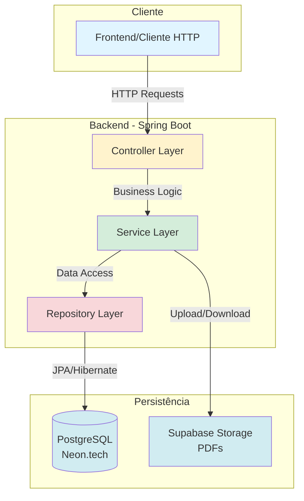
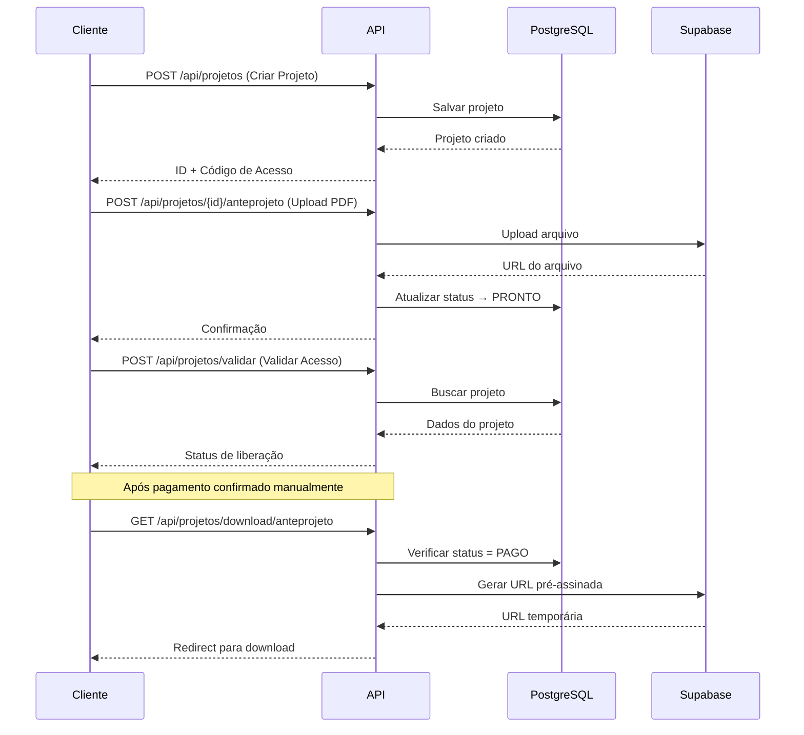

# 📋 Sistema de Liberação de Projetos

<div align="center">


**Sistema robusto para gerenciamento e liberação de projetos de engenharia com controle de acesso, validação de pagamento e armazenamento seguro em nuvem.**

[Documentação da API](./docs/API.md) • [Relatório de Bugs](https://github.com/seu-usuario/liberacao-projetos/issues) • [Solicitar Feature](https://github.com/seu-usuario/liberacao-projetos/issues)

</div>

---

## 📑 Índice

- [Sobre o Projeto](#-sobre-o-projeto)
- [Demonstração](#-demonstração)
- [Funcionalidades](#-funcionalidades)
- [Tecnologias](#-tecnologias)
- [Arquitetura](#-arquitetura)
- [Pré-requisitos](#-pré-requisitos)
- [Instalação](#-instalação)
- [Configuração](#-configuração)
- [Uso](#-uso)
- [Testes](#-testes)
- [Deploy](#-deploy)
- [Documentação da API](#-documentação-da-api)
- [Roadmap](#-roadmap)
- [Contribuindo](#-contribuindo)
- [Licença](#-licença)
- [Contato](#-contato)

---

## 🎯 Sobre o Projeto

O **Sistema de Liberação de Projetos** foi desenvolvido para otimizar o processo de entrega de projetos de engenharia (anteprojetos e projetos executivos) com segurança e controle de acesso baseado em pagamento.

### 💡 Problema Resolvido

Empresas de engenharia precisam de uma forma segura de:
- Controlar o acesso a documentos técnicos
- Validar pagamentos antes de liberar documentos
- Gerenciar múltiplos projetos simultaneamente
- Armazenar arquivos de forma segura e escalável

### ✨ Solução

Sistema web que permite:
- **Autenticação Dupla**: Código de Acesso + PIN
- **Controle de Status**: Gerenciamento granular de pagamentos
- **Upload Seguro**: Validação e armazenamento em nuvem
- **Downloads Controlados**: Liberação condicional de documentos

---

## 🎬 Demonstração

```bash
# Criar um novo projeto
curl -X POST http://localhost:8080/api/projetos \
  -H "Content-Type: application/json" \
  -d '{
    "codigoAcesso": "PROJ001",
    "pinAcesso": "1234",
    "nomeCliente": "Construtora ABC",
    "precoAnteprojeto": 1000.00,
    "precoExecutivo": 5000.00
  }'

# Validar acesso e verificar status
curl -X POST http://localhost:8080/api/projetos/validar \
  -H "Content-Type: application/json" \
  -d '{
    "codigoAcesso": "PROJ001",
    "pinAcesso": "1234"
  }'
```

---

## ⚡ Funcionalidades

### Núcleo do Sistema

- ✅ **Gestão de Projetos**
  - Criação com código único e PIN
  - Controle de preços individual por tipo
  - Atualização de status em tempo real

- 🔐 **Segurança**
  - Autenticação dupla fator (Código + PIN)
  - Validação de formato e tamanho de arquivo
  - Controle de acesso baseado em pagamento
  - Armazenamento criptografado (Supabase)

- 📄 **Gerenciamento de Documentos**
  - Upload de PDFs (Anteprojeto e Executivo)
  - Validação automática de tipo MIME
  - Limite de 50MB por arquivo
  - URLs pré-assinadas para download seguro

- 💰 **Controle de Pagamento**
  - Status independente por tipo de documento
  - Fluxo: `AGUARDANDO_PAGAMENTO` → `PRONTO` → `PAGO`
  - Validação antes de liberar downloads

### Features Adicionais

- 📊 Dashboard de status do projeto
- 🔄 Atualização de status em lote
- 📧 Notificações de mudança de status (planejado)
- 📱 API RESTful completa

---

## 🛠 Tecnologias

### Backend

| Tecnologia | Versão | Uso |
|-----------|--------|-----|
| **Java** | 11+ | Linguagem principal |
| **Spring Boot** | 3.x | Framework web |
| **Spring Data JPA** | 3.x | Persistência de dados |
| **Maven** | 3.6+ | Gerenciamento de dependências |
| **Lombok** | Latest | Redução de boilerplate |

### Banco de Dados & Storage

| Serviço | Uso |
|---------|-----|
| **PostgreSQL** (Neon.tech) | Banco de dados principal |
| **Supabase Storage** | Armazenamento de PDFs |

### Deploy & DevOps

| Serviço | Uso |
|---------|-----|
| **Render** | Hospedagem da API |
| **GitHub Actions** | CI/CD (planejado) |

---

## 🏗 Arquitetura



### Estrutura de Pacotes

```
src/main/java/com/metrica/liberacao/
├── 📦 domain/              # Entidades JPA e enums
│   ├── Projeto.java
│   └── StatusProjeto.java
├── 📦 dto/                 # Data Transfer Objects
│   ├── ProjetoRequestDTO.java
│   ├── ProjetoResponseDTO.java
│   └── ValidacaoAcessoDTO.java
├── 📦 service/             # Lógica de negócio
│   ├── ProjetoService.java
│   └── SupabaseStorageService.java
├── 📦 repository/          # Camada de dados
│   └── ProjetoRepository.java
├── 📦 controller/          # Endpoints REST
│   └── ProjetoController.java
├── 📦 exception/           # Tratamento de erros
│   ├── ProjetoNotFoundException.java
│   └── GlobalExceptionHandler.java
└── 📦 config/              # Configurações
    ├── CorsConfig.java
    └── SupabaseConfig.java
```

---

## 📋 Pré-requisitos

Antes de começar, certifique-se de ter instalado:

- ☕ **JDK 11 ou superior** - [Download](https://www.oracle.com/java/technologies/downloads/)
- 📦 **Maven 3.6+** - [Download](https://maven.apache.org/download.cgi)
- 🐳 **Docker** (opcional) - [Download](https://www.docker.com/products/docker-desktop)
- 🔧 **Git** - [Download](https://git-scm.com/downloads)

### Contas Necessárias

- 🗄️ **Neon.tech** - [Criar conta gratuita](https://neon.tech/)
- ☁️ **Supabase** - [Criar conta gratuita](https://supabase.com/)
- 🚀 **Render** (para deploy) - [Criar conta gratuita](https://render.com/)

---

## 🚀 Instalação

### 1️⃣ Clone o Repositório

```bash
git clone https://github.com/seu-usuario/liberacao-projetos.git
cd liberacao-projetos
```

### 2️⃣ Configure as Variáveis de Ambiente

Copie o arquivo de exemplo e preencha com suas credenciais:

```bash
cp .env.example .env
```

Edite o arquivo `.env` com suas credenciais reais (veja seção [Configuração](#-configuração)).

### 3️⃣ Instale as Dependências

```bash
mvn clean install
```

### 4️⃣ Execute a Aplicação

```bash
mvn spring-boot:run
```

A API estará disponível em: **http://localhost:8080**

---

## ⚙️ Configuração

### Variáveis de Ambiente

Crie um arquivo `.env` na raiz do projeto ou configure no `application.yml`:

```yaml
spring:
  application:
    name: liberacao-projetos
  
  # Configuração do Banco de Dados (Neon.tech)
  datasource:
    url: jdbc:postgresql://${DB_HOST}:${DB_PORT}/${DB_NAME}?sslmode=require
    username: ${DB_USER}
    password: ${DB_PASSWORD}
    driver-class-name: org.postgresql.Driver
  
  # Configuração JPA
  jpa:
    hibernate:
      ddl-auto: update
    show-sql: false
    properties:
      hibernate:
        dialect: org.hibernate.dialect.PostgreSQLDialect
        format_sql: true
  
  # Upload de Arquivos
  servlet:
    multipart:
      max-file-size: 50MB
      max-request-size: 50MB

# Configuração do Supabase
supabase:
  url: ${SUPABASE_URL}
  key: ${SUPABASE_KEY}
  bucket: projetos-pdfs

# Configuração do Servidor
server:
  port: 8080
  error:
    include-message: always
    include-binding-errors: always
```

### 📝 Arquivo .env.example

```env
# Database Configuration (Neon.tech)
DB_HOST=seu-host.neon.tech
DB_PORT=5432
DB_NAME=seu_database
DB_USER=seu_usuario
DB_PASSWORD=sua_senha_segura

# Supabase Configuration
SUPABASE_URL=https://seu-projeto.supabase.co
SUPABASE_KEY=sua_chave_supabase
SUPABASE_BUCKET=projetos-pdfs

# Server Configuration
SERVER_PORT=8080
```

### 🗄️ Configuração do Banco de Dados (Neon.tech)

1. Acesse [Neon.tech](https://neon.tech/)
2. Crie um novo projeto
3. Copie as credenciais de conexão
4. Cole no arquivo `.env`

### ☁️ Configuração do Supabase Storage

1. Acesse [Supabase](https://supabase.com/)
2. Crie um novo projeto
3. Vá em **Storage** → **Create Bucket**
4. Nome do bucket: `projetos-pdfs`
5. Configure como **privado**
6. Copie a URL e chave da API
7. Cole no arquivo `.env`

---

## 💻 Uso

### Fluxo Básico



### Exemplos de Requisições

Veja exemplos completos na [Documentação da API](./docs/API.md).

---

## 🧪 Testes

```bash
# Executar todos os testes
mvn test

# Executar testes com cobertura
mvn test jacoco:report

# Relatório de cobertura estará em:
# target/site/jacoco/index.html
```

---

## 🌐 Deploy

### Deploy no Render

1. **Crie um novo Web Service** no [Render](https://render.com/)
2. **Conecte seu repositório** GitHub
3. **Configure as variáveis de ambiente** no painel do Render
4. **Build Command**: `mvn clean install`
5. **Start Command**: `java -jar target/liberacao-projetos-0.0.1-SNAPSHOT.jar`

### Variáveis de Ambiente no Render

Adicione todas as variáveis do arquivo `.env` no painel do Render.

---

## 📚 Documentação da API

### Endpoints Principais

| Método | Endpoint | Descrição |
|--------|----------|-----------|
| `POST` | `/api/projetos` | Criar novo projeto |
| `POST` | `/api/projetos/validar` | Validar acesso |
| `POST` | `/api/projetos/{id}/anteprojeto` | Upload anteprojeto |
| `POST` | `/api/projetos/{id}/executivo` | Upload executivo |
| `GET` | `/api/projetos/download/anteprojeto` | Download anteprojeto |
| `GET` | `/api/projetos/download/executivo` | Download executivo |
| `PUT` | `/api/projetos/{id}/status/anteprojeto` | Atualizar status anteprojeto |
| `PUT` | `/api/projetos/{id}/status/executivo` | Atualizar status executivo |

### Status do Projeto

```java
public enum StatusProjeto {
    AGUARDANDO_PAGAMENTO,  // Projeto criado, aguardando pagamento
    PRONTO,                // Documento enviado, aguardando confirmação de pagamento
    PAGO                   // Liberado para download
}
```

Para documentação completa com exemplos de request/response, veja [API.md](./docs/API.md).

---

## 🗺 Roadmap

- [x] Sistema de autenticação dupla
- [x] Upload e download de PDFs
- [x] Controle de status de pagamento
- [x] Integração com Supabase
- [ ] Sistema de notificações por email
- [ ] Dashboard administrativo
- [ ] Integração com gateway de pagamento
- [ ] API de webhooks para status
- [ ] Logs e auditoria detalhados
- [ ] Testes automatizados completos
- [ ] Documentação Swagger/OpenAPI
- [ ] Sistema de backup automático

---

## 🤝 Contribuindo

Contribuições são sempre bem-vindas! Siga os passos abaixo:

1. **Fork** o projeto
2. Crie uma **branch** para sua feature (`git checkout -b feature/AmazingFeature`)
3. **Commit** suas mudanças (`git commit -m 'Add: nova funcionalidade incrível'`)
4. **Push** para a branch (`git push origin feature/AmazingFeature`)
5. Abra um **Pull Request**

### Padrões de Commit

- `Add:` Nova funcionalidade
- `Fix:` Correção de bug
- `Update:` Atualização de código
- `Docs:` Alteração em documentação
- `Style:` Formatação de código
- `Refactor:` Refatoração
- `Test:` Adição de testes

---

## 📄 Licença

Este projeto está sob a licença MIT. Veja o arquivo [LICENSE](LICENSE) para mais detalhes.

---

## 📬 Contato

**Daniel H. Moura**

- 💼 LinkedIn: [Danielhmoura](www.linkedin.com/in/danielhmoura)
- 📧 Email: danielhsmoura@outlook.com
- 🐙 GitHub: [@DanielHMoura](https://github.com/DanielHMoura)

---

<div align="center">

**⭐ Se este projeto foi útil, considere dar uma estrela!**

Desenvolvido com ❤️ por [Daniel H. Moura](https://github.com/DanielHMoura)

</div>
